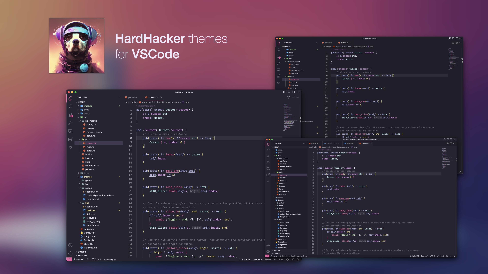

  

<h1 align="center">
  HardHacker Theme for VSCode
</h1>

**Features:**
* Suitable for prolonged use
* Color-blind friendly
* Good readability
* Futuristic
* Provides high-contrast version

**Also supports:**
* iTerm2
* macOS Terminal
* windows Terminal
* vim
* 🚧Continuously building

## Install

* Search `HardHacker` in VSCode Marketplace and click install
